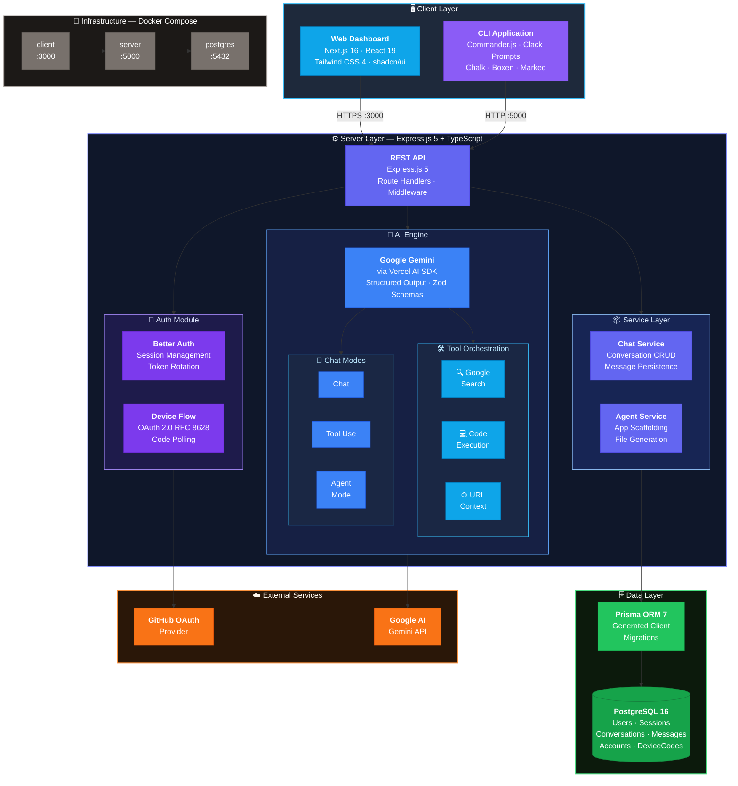
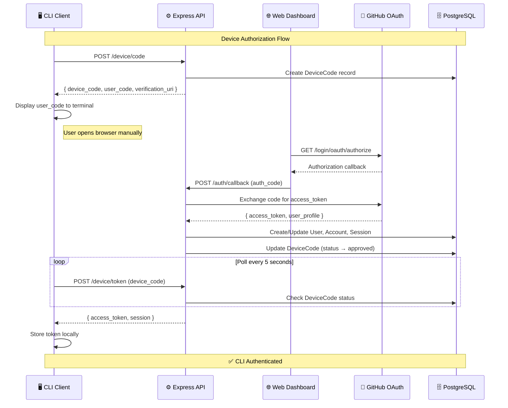
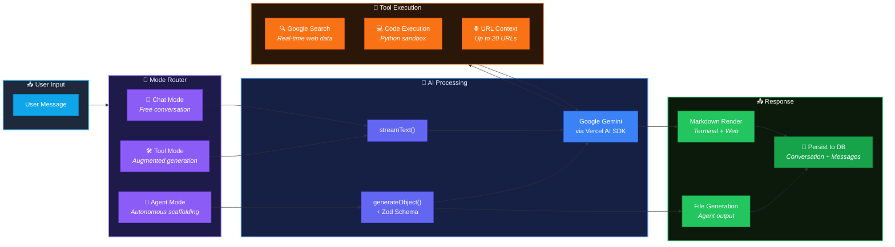
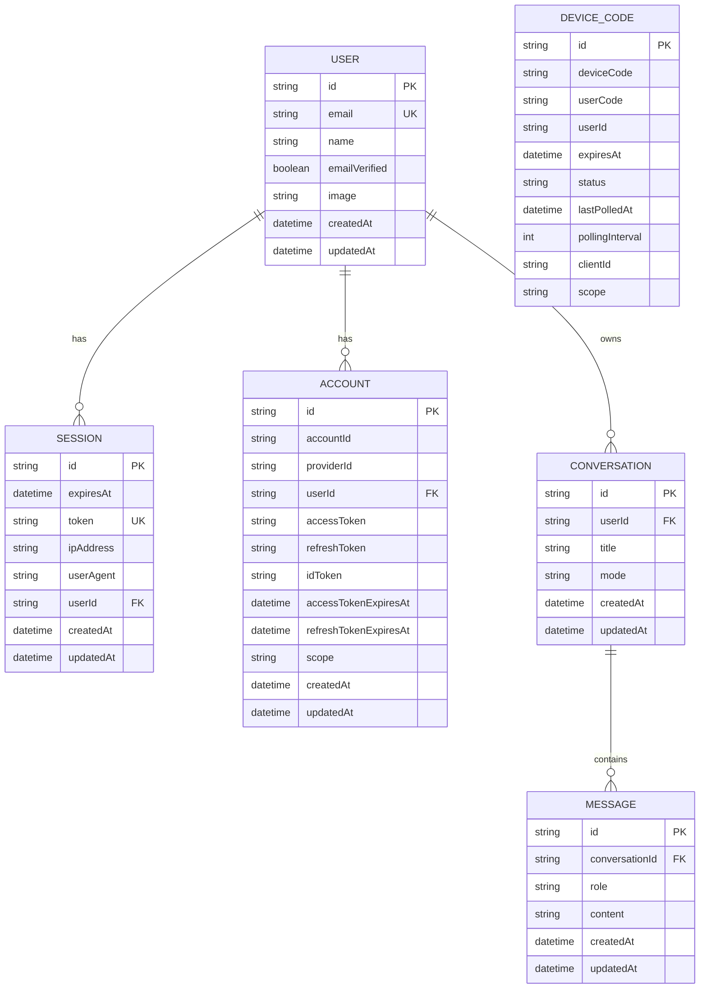
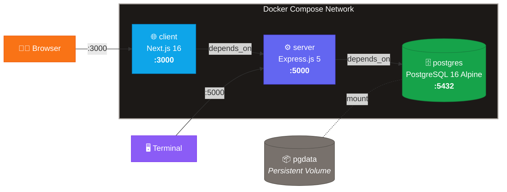

# 🧠 Coremind — System Design

**High-level architecture, data flow, and entity-relationship diagrams**

---

## 🏗️ System Architecture

---

## 🔐 Authentication Flow — OAuth 2.0 Device Authorization Grant (RFC 8628)

---

## 🤖 AI Chat & Tool Pipeline

---

## 📁 Entity-Relationship Diagram

---

## 🐳 Docker Compose Topology

---

**🧠 Coremind** — AI-native developer tooling, engineered for the modern stack.

